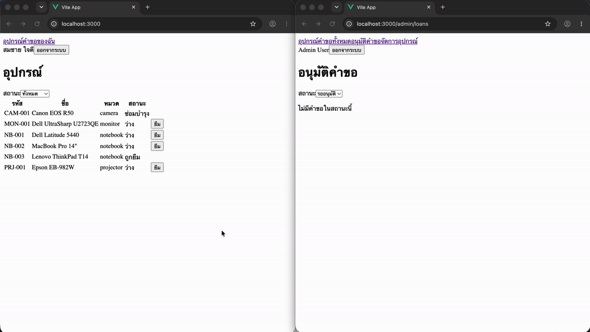
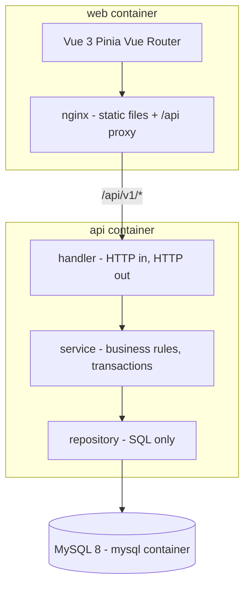
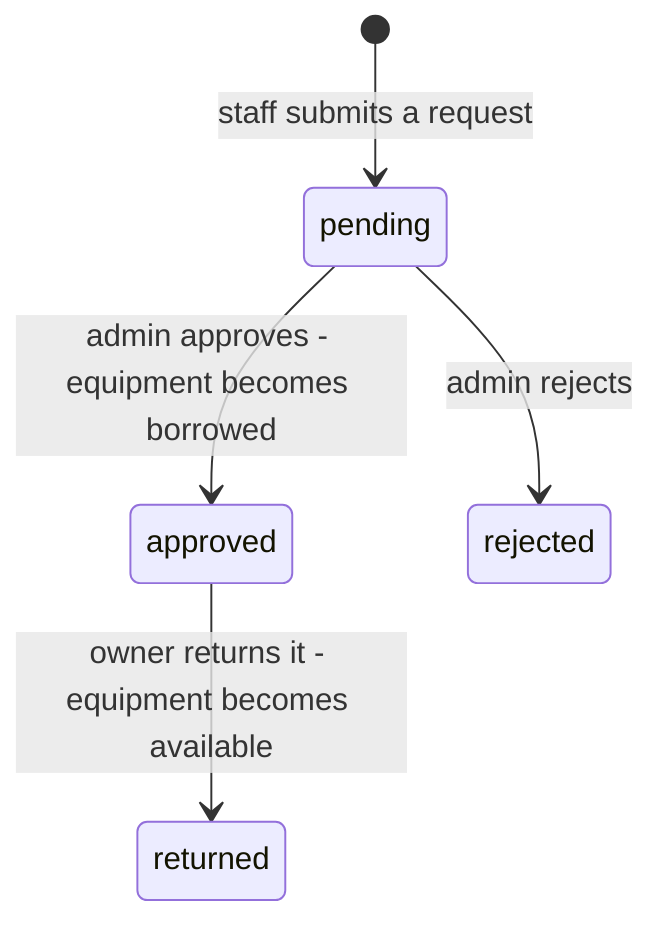

# Equipment Loan System


Staff borrow shared equipment, administrators approve and track it, and the same item can never be out with two people at once.



## Running it

```bash
git clone https://github.com/thegenggo/equipment-loan.git
cd equipment-loan
cp .env.example .env # then set DB passwords and JWT_SECRET
docker compose up --build
```

Open <http://localhost:3000>.

Seed accounts (**development only** - see `api/internal/database/migrations/004_seed.sql`):

| Email | Password | Role |
|---|---|---|
| `admin@example.com` | `admin1234` | admin |
| `somchai@example.com` | `staff1234` | staff |
| `malee@example.com` | `staff1234` | staff |

A real deployment would create the first administrator from an environment variable instead of shipping one in repository.

## Architecture



Dependencies point one way. A handler never contains a business rule, a service never sees `*gin.Context`, and a repository never decides anything.

## Loan lifecycle



## Tech stack

| Layer | Choice |
|---|---|
| Frontend | Vue 3 (Composition API), Typescript, Pinia, Vue Router, Vite |
| Backend | Go 1.27, Gin, sqlx |
| Database | MySQL 8 |
| Auth | JWT (HS256), bcrypt |
| Delivery | Docker Compose, multi-stage builds, nginx |
| CI | Github Actions - gofmt, go vet, go test -race, pnpm build |

